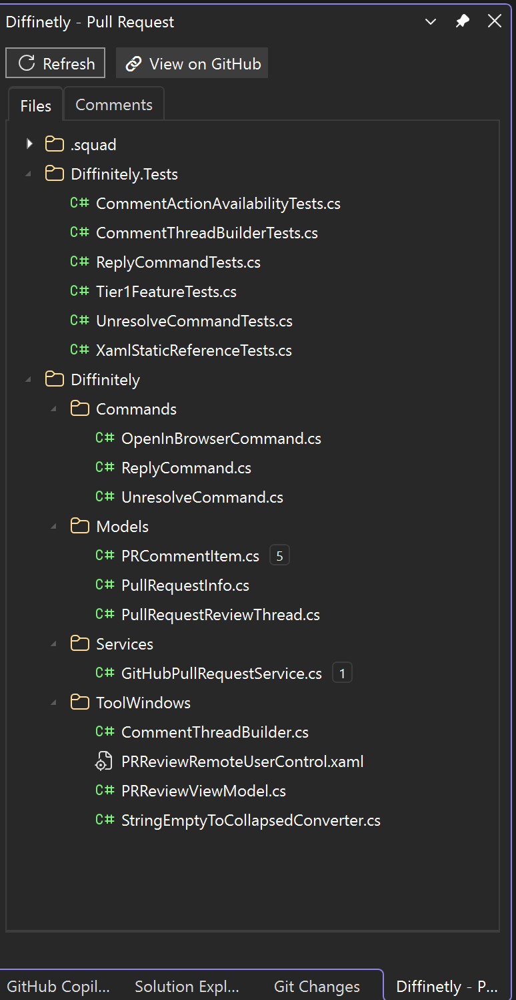
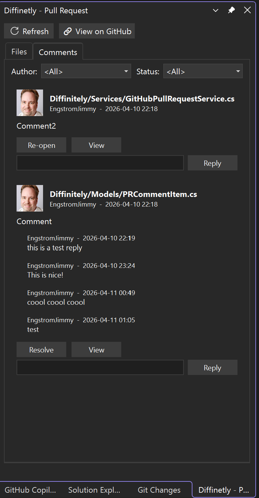

# Diffinitely

A Visual Studio 2022 extension that brings GitHub pull request reviews directly into your IDE — no browser tab switching required.


## Overview

Diffinitely adds a **Pull Request Review** tool window to Visual Studio 2022. It automatically detects the current Git branch, finds the corresponding GitHub pull request, and presents changed files and review comments in a tabbed side panel. Open diffs with one click, reply to review threads, and jump to GitHub — all without leaving the IDE.

## Screenshots





## Features

- **Changed Files Tree** — Browse all PR-changed files in a hierarchical tree with file-type icons, change kind indicators (Added, Modified, Deleted, Renamed), and comment count badges.
- **Side-by-Side Diff** — Open any file in VS's native diff viewer, comparing the base version against the PR version. Use the **View** button on a comment to open the diff for that specific file.
- **Review Comments** — View all PR review comments with author avatars, file paths, timestamps, thread replies, and outdated badges. Reply to any thread directly from the extension.
- **Comment Filtering** — Filter comments by author and by resolution status (All / Resolved / Unresolved).
- **View on GitHub** — Opens the current pull request on GitHub.com in your default browser.
- **Status Bar** — A persistent footer always shows the current status (e.g., "Reply sent") and a loading indicator while data is being fetched.
- **VS Theme Support** — Fully integrates with Visual Studio's dark and light themes, including VS-styled tabs with hover and active-tab effects.
- **Zero Extra Credentials** — Picks up your GitHub token automatically from Git Credential Manager.

## Requirements

- Visual Studio 2022 (v17.14 or later)
- .NET 4.7.2
- Git installed and available in `PATH`
- A GitHub account with access to the repository being reviewed

## Getting Started

### Install

1. Build the solution (see below) or download the latest `.vsix` from [Releases](../../releases).
2. Double-click the `.vsix` file to install.
3. Restart Visual Studio.

### Open the Tool Window

Go to **View → Other Windows → Diffinitely - Pull Request**, or use **Extensions → Diffinitely**.

The extension will automatically detect the active repository and current branch, then load the matching pull request from GitHub.

## Building from Source

```powershell
git clone https://github.com/EngstromJimmy/Diffinitely.git
cd Diffinitely
dotnet build
```

The compiled `.vsix` will be in `Diffinitely\bin\Debug\`.

To run in a sandboxed experimental instance of Visual Studio, open the solution in VS 2022 and press **F5**.

## Project Structure

```
Diffinitely/
├── Commands/           # VS extension commands (open diff, open for review)
├── Models/             # Data models (PR info, changed files, comments, tree nodes)
├── Services/           # GitHub API (Octokit) and Git repository logic
├── ToolWindows/        # WPF UI — XAML views, view model, value converters
├── DiffinitelyPackage.cs       # VS package entry point
└── source.extension.vsixmanifest
```

## Authentication

Diffinitely resolves your GitHub token in this order:

1. In-memory cache (current session)
2. Git Credential Manager (`git credential fill`)

The token is held in memory only and is never written to disk. On next launch, it will be re-acquired from Git Credential Manager (seamless if GCM already has the credential stored).

If none of these are available, the GitHub API is used unauthenticated (lower rate limits).

## Tech Stack

| Component | Technology |
|-----------|-----------|
| Language | C# 12 |
| UI | WPF (XAML) |
| VS Integration | Visual Studio Extensibility SDK 17.14 |
| GitHub API | Octokit 14.0 |
| Architecture | MVVM |

## Contributing

Contributions are welcome! Please open an issue or submit a pull request.

## License

MIT License — see [LICENSE](LICENSE) for details.

If you find Diffinitely useful, consider [sponsoring on GitHub](https://github.com/sponsors/EngstromJimmy) — it helps keep the project going. ❤️
